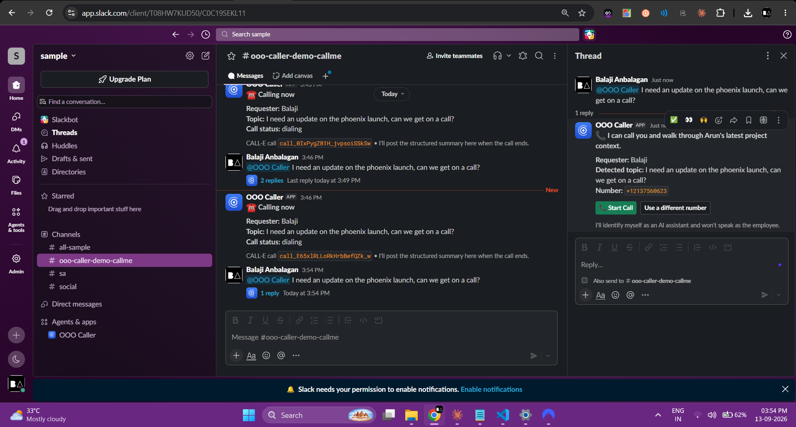
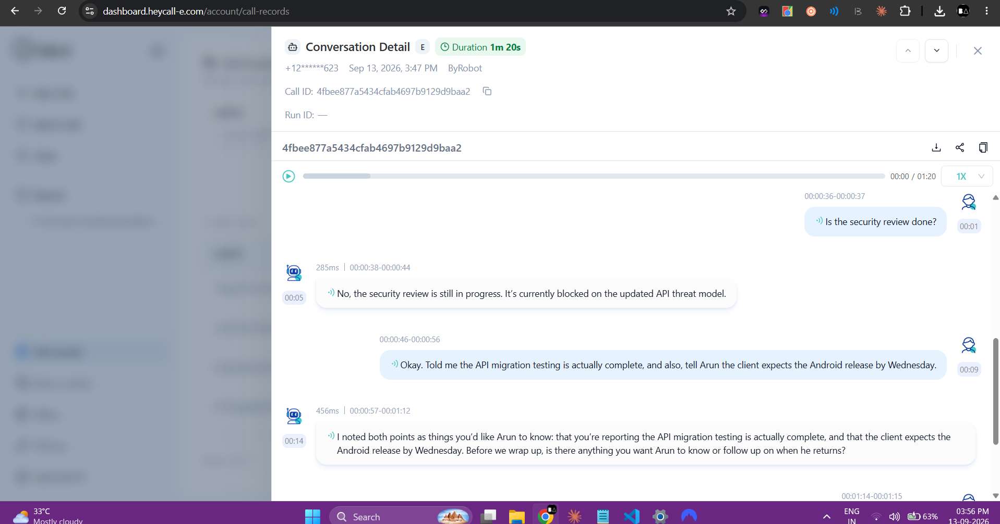
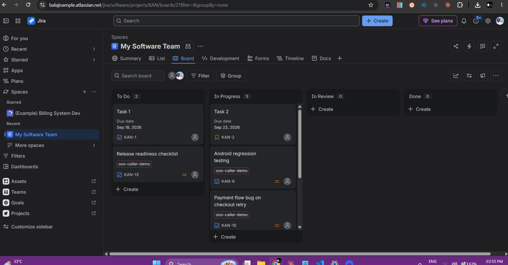

<p align="center">
  
</p>

<h1 align="center">OOO-Pilot</h1>
<p align="center"><b>A temporary AI work proxy that takes real phone calls for an employee who is out of office.</b></p>
<p align="center">
  Built on <a href="https://docs.heycall-e.com/">CALL-E</a>, Slack, Jira, local git and SQLite.<br/>
  <a href="https://balajianbalagan.pages.dev/">balajianbalagan.pages.dev</a> ·
  <a href="docs/index.html">Landing page</a> ·
  <a href="mailto:vijibalaji2003@gmail.com">Contact</a>
</p>

---

## The problem

When a project lead goes out of office, their work does not. Coworkers still need
answers, and the tools we have today handle this badly:

- An auto-responder says "Arun is away until Monday." That is where it ends.
- A status-bot answers one question in a text thread, then loses the thread.
- Escalating to a manager means someone re-reads Jira and guesses.

The real cost is not the unanswered question. It is that **the conversation never
happens**, so the information a coworker was carrying — a client deadline, a
correction to a Jira status, a blocker — never reaches the absent person. They come
back to an inbox, not a handoff.

That conversation is specifically a *phone* problem. The requester needs to ask a
follow-up, clarify something ambiguous, and confirm what gets passed on. A form
cannot do that.

## The solution

OOO-Pilot is **not** a chatbot that answers questions while someone is away.
It is an agent that temporarily becomes the **conversational work proxy** for an
absent employee.

```
Arun goes OOO
   → Raj needs an update on the Phoenix launch
   → OOO-Pilot loads Arun's verified Jira (and git) context
   → CALL-E phones Raj
   → a real conversation happens
   → new information, follow-ups and blockers are captured
   → Arun returns to a complete handoff summary
```

On the call, the agent explains the verified project status, answers follow-ups
from the supplied context only, asks what Arun should know, and reads back the
follow-ups to confirm them. It identifies itself as an AI assistant and never
speaks as Arun.

### What makes it more than "an AI that makes phone calls"

**It knows the difference between a fact and a claim.** Jira is authoritative.
Anything a coworker says on the phone is stored as `CONVERSATION`-sourced and
`verified = false`. It never rewrites Jira.

That distinction produces the feature that pays for the whole system — the
**discrepancy report**:

> ⚠️ Jira still shows **KAN-12** as **In Progress**, but Raj reported during an
> OOO call: "the API migration testing is actually complete" — verify this before
> updating Jira.

That is knowledge that existed only in someone's head, surfaced because a phone
call happened and was recorded structurally.

---

## Proof it works

Screenshots and the actual recorded audio from a real outbound CALL-E call, running
the exact demo script below.

| | |
|---|---|
|  |  |
| Slack: mention → call offer → live "Calling now" status, threaded. | CALL-E's own dashboard transcript: the agent answering from Jira context, then recording a coworker's claim to confirm. |


<sub>Jira: the authoritative board OOO-Pilot syncs from.</sub>

**[▶ Listen to the actual call](images_and_asset/sample_convo_with_bot.wav)** — recorded live via CALL-E.

<audio controls src="images_and_asset/sample_convo_with_bot.wav"></audio>

*(GitHub's file preview renders that player inline; if your viewer doesn't, use the link above.)*

---

## Inbound calls

**CALL-E is an outbound calling platform — there is no API to answer a ringing
phone.** Rather than drop inbound support, OOO-Pilot implements it the way contact
centres implement deflection: **capture the inbound request, then immediately call
the person back** with an agent that already has their context loaded.

From the coworker's side, they contact Arun's OOO line and get a phone conversation
about it seconds later.

Every inbound channel normalizes into the same `InboundRequest` record and then
into the same call pipeline:

| Channel | Endpoint | Trigger |
|---|---|---|
| Missed call / IVR hang-up | `POST /inbound/call` | Telephony DID webhook |
| SMS to the OOO line | `POST /inbound/sms` | SMS provider webhook |
| "Call me" web widget | `POST /inbound/web` | `/inbound.html` demo page |
| Slack mention | Socket Mode event | `@OOO-Pilot ...` |
| Any agent via MCP | `request_callback` tool | MCP client |

A real number (Twilio, Vonage, a SIP trunk) drops in by pointing its missed-call
webhook at `POST /inbound/call` and mapping its caller-id field to `from`. No other
code changes.

**Honest statement of the boundary:** OOO-Pilot does not answer live inbound calls,
because CALL-E does not expose that capability. It converts an inbound contact into
an outbound CALL-E call within seconds. A native inbound CALL-E endpoint would slot
in as one more channel behind `handleInboundRequest()`.

---

## Custom knowledge & git integration

Jira and phone calls aren't the only places work context lives. Two more sources
feed the same knowledge store:

**A local git repo.** `POST /sync/git { repoPath, since }` reads `git log` on a
working tree on disk — no push, no credentials, no network call — and turns recent
commits into knowledge items, so *code changes made while the employee was away*
become part of the call brief under their own **"RECENT CODE CHANGES"** section,
separate from Jira and separate from what a coworker claimed on a call.

**A client-side console for both.** [`public/knowledge.html`](public/knowledge.html)
(served at `/knowledge.html`) lets you add a custom knowledge item by hand, trigger a
git sync against a repo path, and browse everything currently in the store —
filterable by source (Jira / Git / Conversation / Manual), with delete for manual
entries. It's the same dark-console aesthetic as the admin console, reusing the
existing `/knowledge` and `/sync/git` endpoints.

```bash
# add a fact by hand
curl -X POST localhost:3000/knowledge \
  -H 'content-type: application/json' \
  -d '{"title":"Client escalation","content":"Client asked for release notes early.","type":"NOTE"}'

# sync a local repo
curl -X POST localhost:3000/sync/git \
  -H 'content-type: application/json' \
  -d '{"repoPath":"D:/projects/phoenix-mobile","since":"3 days ago"}'
```

Both are also exposed as MCP tools (`record_custom_knowledge`, `sync_git_repo`), so
an agent client can add context or sync a repo the same way a human would through
the page.

---

## Architecture

One Node process. SQLite. No vector database, no RAG, no microservices.

```
              ┌────────── Slack (Socket Mode) ──────────┐
              │  /ooo on · /ooo off · /ooo status       │
              │  @OOO-Pilot mention → "Start Call"      │
              └────────────────────┬────────────────────┘
                                   │
  inbound intake ──────────────────┤
  (call / SMS / web / MCP)         │
                                   ▼
                          ┌─────────────────┐
                          │  OOO service    │
                          └────────┬────────┘
                                   │
       ┌───────────────┬───────────┼───────────┬───────────────┐
       ▼               ▼           ▼           ▼               ▼
  context builder   safety     CALL-E SDK    git log      knowledge.html
  (Jira+Git+SQLite)  policy    calls.create()  (local)    (custom notes)
       │                                            │
       ▼                                            ▼
 ┌──────────┐                          ☎️  real phone call
 │  SQLite  │◄──── result parser ◄──── webhook / polling
 └──────────┘      + LLM extractor
       │
       ▼
 return-from-OOO summary · MCP server · Slack blocks · admin console
```

### File structure

```
src/
├── index.ts                 Express server: webhooks, inbound, OOO control, knowledge, git
├── config.ts                Env loading + startup capability report
├── slack/                   app · commands · events · blocks
├── ooo/                     service · state · context-builder · return-summary · activity-log
├── knowledge/                sqlite · repository · search (providers) · types
├── jira/                     client · sync · webhook
├── git/                      client · sync            ← local commits as knowledge
├── calle/                    client · call-builder · result-parser
├── inbound/                  intake · routes           ← inbound workaround
├── conversation/              extractor
├── mcp/                       server.ts
└── safety/                    policy.ts

public/
├── inbound.html    "call me" web widget (the inbound demo line)
├── admin.html      live activity log, conversations, follow-ups
└── knowledge.html  add custom knowledge, sync git, browse the store

docs/
└── index.html      GitHub Pages landing site (this project's own site)

brand/               logo, tokens, brand kit
images_and_asset/    real screenshots + a recorded call from a live demo
```

---

## CALL-E integration

Uses the official TypeScript server SDK, `@call-e/calle@0.7.0`.

**Placing the call** — [`src/calle/client.ts`](src/calle/client.ts):

```ts
const call = await calle().calls.create({
  task: brief.task,                                   // the full agent instruction
  recipient: { phone, ...localeForPhone(phone) },      // region/locale from country code
  resultSchema: OOO_RESULT_SCHEMA,                     // structured extraction
  metadata: { conversation_id, employee_id, requester, topic },
  webhookUrl: config.calle.webhookUrl,
}, { idempotencyKey: `ooo:${conversation.id}` });
```

**Getting the result back** — two paths, both idempotent:

1. `POST /webhooks/calle` receives the terminal call task. Deliveries are unsigned,
   so events are de-duplicated on the event `id` and rejected when it does not match
   the `CALL-E-Event-Id` header.
2. When no public webhook URL is configured, `calls.waitForResult()` polls instead.

Both funnel into `handleTerminalCall()`, which skips conversations already marked
`COMPLETED`.

**Structured results.** `resultSchema` asks CALL-E to extract questions, answers,
new information, follow-ups, decisions, commitments and unresolved items directly
from the conversation. If CALL-E cannot materialize a schema-valid result (e.g. the
call ended early), the transcript from `recipients[].attempts[].transcriptTurns` is
re-extracted with an LLM as a second pass.

**Outbound line.** CALL-E's default *shared* line allows only **one concurrent call
per account**, and in testing it terminated poorly to some international numbers
(SIP `408`/`404`, 0s duration, no transcript — see [Difficulties faced](#difficulties-faced)
below). Completing identity verification and purchasing a **dedicated number**, then
selecting it as the account's default outbound number, raises concurrency to 10 and
gives calls a line of their own. There is no `from`/`caller_id` field in
`CreateCallInput` — the outbound number is chosen account-side in the CALL-E
dashboard, not per call.

To avoid paying for calls that cannot succeed, `startConversationCall()` refuses to
place a second call while one is still in flight (with a 10-minute staleness window
so a killed process cannot permanently block new calls).

**Dry run.** Set `CALLE_DRY_RUN=true` to exercise the entire pipeline — context,
extraction, SQLite, discrepancy detection, return summary — using a built-in
stand-in call. Useful for rehearsing the demo without spending credits.

---

## Slack flow

Slack is the frontend; there is no separate dashboard.

| Command | Effect |
|---|---|
| `/ooo on` | Activates OOO mode, kicks off a Jira sync, posts the status card |
| `/ooo off` | Posts the return-from-OOO summary and deactivates |
| `/ooo status` | Shows whether OOO-Pilot is covering, since when, and call/follow-up counts |
| `/ooo sync` | Re-syncs Jira on demand |
| `@OOO-Pilot <question>` | Offers a call with a **Start Call** button |

During and after a call, the bot posts back into the same thread: dialing status,
then the structured summary (questions, information communicated, new information
marked unverified, follow-ups, unresolved items).

Include a number in the mention (`@OOO-Pilot update on Phoenix +14155550100`) or
fall back to `RAJ_PHONE`.

---

## Jira synchronization

Jira is the **authoritative** source for Jira-derived facts.

- `POST /sync/jira` pulls the project with JQL and upserts issues **and each comment**
  as separate knowledge items, so a fresh comment outranks a stale issue body. It uses
  `/rest/api/3/search/jql`; the older `/rest/api/3/search` was removed by Atlassian
  (CHANGE-2046) and now returns `410 Gone`.
- `POST /webhooks/jira` handles `issue_created`, `issue_updated`, `issue_deleted` and
  comment events. Register it with a JQL filter (`project = KAN`). Issue payloads are
  re-fetched because webhook bodies omit comments.
- Upserts are keyed on `(source_type, source_id)`, so re-syncing is idempotent.
- `JIRA_JQL` optionally overrides the sync query, to scope it to labelled demo issues
  in a shared/real Jira project instead of the whole board.

**Without Jira credentials the demo still runs** on seeded Phoenix data, so setup
never blocks the call path.

---

## SQLite knowledge model

| Table | Holds |
|---|---|
| `employees` | Identity, phone, OOO state and window |
| `projects` | Project metadata and Jira key |
| `knowledge_items` | Everything known, tagged `JIRA` / `SLACK` / `CONVERSATION` / `MANUAL` / `GIT` |
| `conversations` | One row per call, with transcript, summary and `direction` |
| `conversation_items` | `QUESTION` · `ANSWER` · `NEW_INFORMATION` · `FOLLOW_UP` · `COMMITMENT` · `DECISION` · `UNRESOLVED` |
| `followups` | Open items awaiting the employee's return |
| `inbound_requests` | Inbound contacts and the callbacks they triggered |

`knowledge_items.verified` is the load-bearing column: Jira and git rows are
`verified = 1`, phone-call rows are `verified = 0` and stay that way until a human
confirms them.

**Context building** ([`src/ooo/context-builder.ts`](src/ooo/context-builder.ts)) is
bounded and prioritized — newest Jira updates, then recent git commits, then verified
knowledge, then recent conversation-derived knowledge, then older project context.
The whole database is never dumped into the model.

---

## MCP

`src/mcp/server.ts` exposes semantic work operations over the same SQLite store —
not CRUD wrappers. Any MCP client can read an absent employee's context, record what
it learned, sync a repo, and trigger a callback.

| Tool | Purpose |
|---|---|
| `search_employee_context` | Search Jira + git + notes + call-derived facts |
| `get_project_context` | Build the full briefing for a topic |
| `get_recent_updates` | Newest work updates |
| `get_open_followups` | What is waiting for the employee |
| `record_conversation` | Store a conversation held on their behalf |
| `record_new_information` | Store a coworker's claim as unverified |
| `record_followup` | Add a return-to-work item |
| `record_custom_knowledge` | Add a manual fact/note to the store |
| `get_return_summary` | Full handoff incl. discrepancies |
| `request_callback` | **Trigger an inbound-initiated CALL-E callback** |
| `sync_jira_project` | Re-sync Jira |
| `sync_git_repo` | Pull recent commits from a local repo into the store |
| `list_conversations` | Conversation log |

Run with `npm run mcp` (stdio). Example client config:

```json
{
  "mcpServers": {
    "ooo-pilot": {
      "command": "npx",
      "args": ["tsx", "src/mcp/server.ts"],
      "cwd": "/absolute/path/to/ooo-pilot"
    }
  }
}
```

---

## Safety boundaries

Enforced in the call instruction ([`call-builder.ts`](src/calle/call-builder.ts)) and
in code ([`safety/policy.ts`](src/safety/policy.ts)).

The agent must:

- Identify itself as an AI OOO assistant, and **never impersonate the employee**
- Never claim the employee said something absent from verified source material
- Never invent project status — say "I don't have a verified answer" instead
- Never make commitments or approvals on the employee's behalf; record follow-ups
- Never approve production changes
- Never request or read out passwords, API keys, credentials, private keys or tokens
- Distinguish authoritative Jira data from coworker-reported information

Enforced mechanically, not just by prompt:

- **Pre-call redaction.** `checkOutboundBrief()` scans the assembled brief for
  credential patterns (bearer tokens, AWS keys, Slack/Atlassian tokens, PEM blocks)
  and redacts them before anything is spoken.
- **Commitment sanitizing.** `sanitizeCommitment()` rewrites any extracted phrasing
  that implies the absent employee agreed to something.
- **E.164 validation** before a number is ever dialed.
- **Concurrency guard.** A second call is refused locally rather than sent to CALL-E
  and paid for, while one is still in flight.
- **Failure isolation.** A failed call's telephony error is stored separately from
  `summary`, so it can never leak into the next call's context as if a coworker had
  said it.
- **Unverified by default** for everything learned on a call.

---

## Setup

```bash
npm install
cp .env.example .env      # fill in your tokens
npm run seed               # seed the Phoenix demo project
npm start
```

Rehearse the whole pipeline in one command (wipes state, re-seeds, syncs Jira,
checks the finale issue, runs preflight):

```bash
npm run rehearse
```

Diagnostic scripts, built while debugging this integration — kept because they're
useful for anyone else standing this up:

| Script | Checks |
|---|---|
| `npm run preflight` | Every credential responds, without placing a call |
| `npm run check:scopes` | Slack bot token's *actual* granted OAuth scopes (not just validity) |
| `npm run check:channels` | Which channels the Slack bot can actually see `@mention`s in |
| `npm run test:call -- +1...` | Places one short real CALL-E call to prove connectivity |
| `npm run inspect:call -- <id>` | Full per-attempt failure detail for a CALL-E call |
| `npm run dump:payload` | Prints the exact CALL-E task text/schema without sending it |
| `npm run seed:jira` | Creates the demo issues in a real Jira project (labelled, easy cleanup) |

### Environment variables

| Variable | Required | Notes |
|---|---|---|
| `SLACK_BOT_TOKEN` | for Slack | `xoxb-…` |
| `SLACK_APP_TOKEN` | for Slack | `xapp-…`, scope `connections:write` |
| `SLACK_SIGNING_SECRET` | optional | Unused in Socket Mode |
| `JIRA_BASE_URL` / `JIRA_EMAIL` / `JIRA_API_TOKEN` | optional | Falls back to seed data |
| `JIRA_PROJECT_KEY` | optional | Default `PHX` |
| `JIRA_JQL` | optional | Overrides the sync query, e.g. to scope to labelled demo issues |
| `CALLE_API_KEY` | **yes** | For real calls |
| `CALLE_BASE_URL` | optional | Default `https://api.heycall-e.com` |
| `CALLE_WEBHOOK_URL` | optional | Public URL (ngrok); otherwise polling |
| `CALLE_REGION` / `CALLE_LOCALE` | optional | Overrides auto-detection from the phone's country code |
| `LLM_API_KEY` / `OPENAI_API_KEY` / `LLM_MODEL` | optional | Transcript fallback extraction (either key name works) |
| `ARUN_PHONE` / `RAJ_PHONE` | for demo | E.164 |
| `CALLE_DRY_RUN` | optional | `true` runs the pipeline without calling |

Secrets live in `.env`, which is git-ignored. Never commit them.

### Slack app setup

Socket Mode on. Bot scopes: `app_mentions:read`, `chat:write`, `commands`,
`users:read`. Slash commands: `/ooo`, `/ooo-callme`. Event subscription:
`app_mention` — **this must be added under "Subscribe to bot events" on the
Event Subscriptions page and saved**, separately from granting the
`app_mentions:read` scope. The scope alone does not make Slack dispatch the event;
missing this step was the single largest time sink while building this (see below).

---

## Demo (≈3 minutes)

Run `npm run seed:jira` once to create the five Phoenix issues in a real Jira
project (labelled `ooo-caller-demo`; scope the sync to them with `JIRA_JQL`). Jira
assigns its own issue numbers, so the keys appear as whatever your project issued —
`KAN-12` rather than `PHX-121`, for example.

1. `/ooo on` in Slack → OOO mode activates, Jira syncs.
2. `@OOO-Pilot I need an update on the Phoenix launch. Can we get on a call?`
3. Bot offers a call → click **Start Call**.
4. **CALL-E rings the phone.** The agent introduces itself as Arun's AI OOO
   assistant and explains Android regression and the security review.
5. Ask a follow-up. Then say: *"Karthik told me the migration testing is actually
   complete — and tell Arun the client expects the Android release by Wednesday."*
6. The agent confirms the follow-up and ends the call.
7. Slack posts the structured summary; SQLite now holds the follow-up and the
   unverified claim.
8. **Admin console** (great on a second monitor): open
   `http://localhost:3000/admin.html` for a live feed of every call, inbound
   contact and Jira sync as it happens.
9. **Knowledge console:** open `http://localhost:3000/knowledge.html`, add a
   custom fact by hand, and sync a local git repo to show commits becoming context.
10. **Inbound:** open `http://localhost:3000/inbound.html`, request a callback —
    the phone rings again, driven by intake rather than Slack.
11. `/ooo off` → the return-from-OOO summary, ending with the discrepancy between
    Jira and what was said on the phone.

---

<a id="difficulties-faced"></a>
## Difficulties faced (the honest version)

The happy path — Slack → context → CALL-E → SQLite → summary — came together in a
day, close to the build order the brief specified. Nearly all the remaining time went
into **making a real phone call actually happen**, and each failure taught something
worth recording:

**1. Slack scopes ≠ Slack event subscriptions.** `@mention` did nothing for a long
time. `app_mentions:read` was granted and the app was reinstalled, but the
`app_mention` **bot event** itself had never been added under Event Subscriptions —
a separate, easy-to-skip step from granting the scope. Diagnosed by adding a raw
Bolt middleware that logs the *type* of every payload Socket Mode delivers
(`[bolt] incoming: ...`), which made "nothing is arriving" versus "something arrived
and crashed" unambiguous.

**2. A context-pollution bug of my own making.** Once calls started failing, their
error text (`"NO ANSWER (Hangup by: bot)"`) was being written into the conversation's
`summary` field — which the *next* call's context builder reads as something a
coworker had said. Found via a `dump:payload` script that prints the exact CALL-E
task text without sending it. Fixed by never writing a telephony failure into
`summary`, and by only feeding *completed* conversations into future context.

**3. The concurrency limit cost real credits.** CALL-E's shared line allows one
concurrent call per account — a second call placed while one is in flight is
rejected, and still bills. This happened because a leftover local server process
from earlier testing was still holding a call open. Fixed by refusing a second call
locally (with a staleness window so a killed process can't wedge the app shut).

**4. International call termination.** Repeated outbound calls to a `+91` number
failed with SIP `408`/`404` — call accepted, dialed, zero duration, zero transcript
— across both the default shared line and a newly-purchased dedicated US number,
despite one earlier call to the same number succeeding. Bisected with a minimal
`test:call` script and an `inspect:call` script that pulls the per-attempt failure
code CALL-E's own summary text flattens away. Ultimately worked around by testing
with a US number instead; logged as feedback below rather than resolved.

**5. Diagnosis over guessing.** Several of the scripts above (`check-scopes`,
`check-channels`, `dump-payload`, `inspect-call`, `rehearse`) exist specifically
because "did you reinstall the app?" and "is the number reachable?" are not
questions you can answer by re-reading documentation — you have to ask the actual
running system. They're kept in the repo because the next person integrating CALL-E
will hit some of the same walls.

---

## Feedback for the CALL-E team

Submitted via the CALL-E Feedback Survey; recorded here too since it came directly
out of building this.

**1. A sandbox / connectivity-check mode.** Real credits were lost to carrier-level
failures (international routing, the one-concurrent-call limit) that had nothing to
do with the integration itself. A free, short "can you hear me?" connectivity check
— distinct from a billable task call — would have caught this in seconds instead of
several failed billable calls.

**2. A faster, no-planning mode for the dashboard assistant.** The dashboard chatbot
visibly plans even for simple responses, which is a slow first impression for anyone
evaluating the platform for the first time. A lighter mode without the planning step
would help.

**3. First-class support for Indian phone numbers.** Outbound calls to `+91` numbers
failed consistently — SIP `408` on the shared line, SIP `404` on a dedicated US
number — despite one earlier call to the same number succeeding. India is a large,
underserved market for this kind of phone automation; reliable termination there
would open real product surface area.

---

## Limitations

- **No live inbound answering.** Inbound is intake + automated callback, as above.
- **One employee, one project.** Multi-tenant routing is not built.
- **Git sync is local-only.** It reads `git log` on a filesystem path; there is no
  GitHub/GitLab API integration (deliberately — the brief asked for local changes,
  not another hosted-API surface).
- Keyword search, not semantic — deliberate for a one-day MVP.
- Discrepancy detection is conservative: it flags completion claims it can tie to a
  specific issue key or a strong title match. It will miss subtler contradictions.
- No auth on the HTTP endpoints; it is a demo server.
- Slack destination routing is in-memory, so it resets on restart.

## Future integrations

- Native CALL-E inbound endpoints, added as one more channel behind `handleInboundRequest()`
- Voice identity verification before disclosing project context
- Confluence, GitHub (hosted API, not just local git) and Google Calendar knowledge providers —
  the `KnowledgeProvider` interface is already the seam
- Suggested Jira transitions from confirmed discrepancies — proposed to the employee,
  never applied automatically
- Multi-employee routing, so a team shares one OOO line

---

## Design note

Two things in this repo are deliberate and worth stating plainly:

**OOO-Pilot currently uses outbound CALL-E calls.** Inbound requests are answered
with an immediate automated callback. Native inbound employee-style phone endpoints
are a future integration opportunity.

**Jira is treated as an authoritative work source, while information learned through
OOO conversations is explicitly marked as conversation-derived until verified.** The
system never updates Jira from a phone call. It reports the conflict and lets the
returning employee decide.

---

<p align="center">
  Built by <b>Balaji Anbalagan</b> for CALL-E: Your Code Is Calling.<br/>
  <a href="https://balajianbalagan.pages.dev/">balajianbalagan.pages.dev</a> ·
  <a href="mailto:vijibalaji2003@gmail.com">vijibalaji2003@gmail.com</a>
</p>
